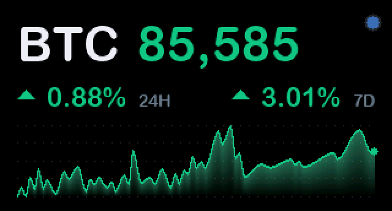
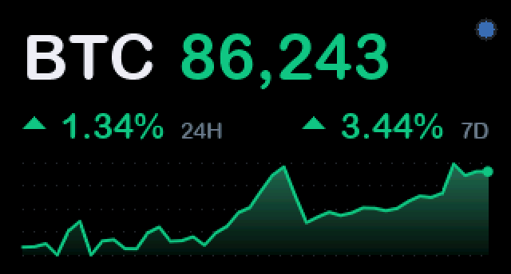
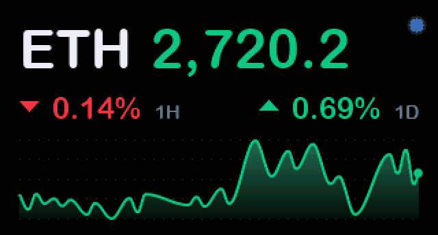
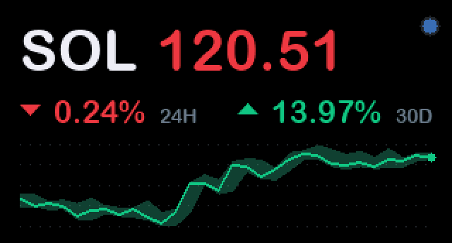
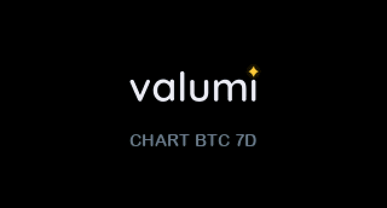
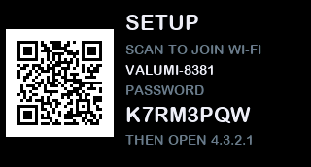
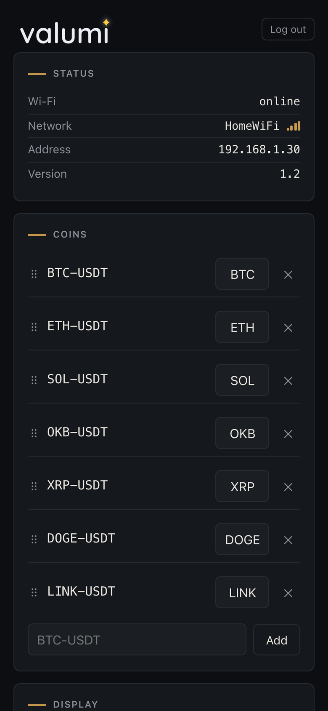
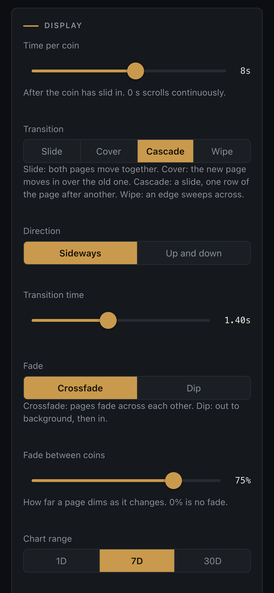
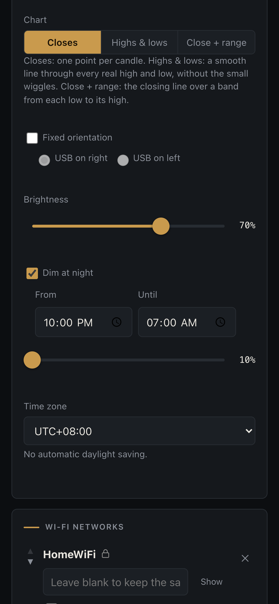

<p align="center">
  <picture>
    <source media="(prefers-color-scheme: dark)" srcset="docs/logo-dark.png">
    
  </picture>
</p>
<br/>
A mini scrolling crypto price ticker for the Waveshare 1.47" ESP32-C6 boards.

<br/>
<br/>
<p align="center">
  
</p>

## Features

- **Up to 15 coins**, any OKX instrument (`BTC-USDT`, `ETH-USDT`, ...),
  validated with the exchange when added. Labels are editable; drag to
  reorder.
- **Charts** over 1 day, 7 days or 30 days, in three styles: a line through
  each candle's close; a smooth line through the real highs and lows of each
  swing; or the close line over a band from each candle's low to its high.
  The right edge always ends at the live price.

<br/>
<table align="center">
  <tr>
    <td align="center"><br><sub>Closes</sub></td>
    <td align="center"><br><sub>Highs &amp; lows</sub></td>
    <td align="center"><br><sub>Close + range</sub></td>
  </tr>
</table>
<br/>

- **Buttery-smooth transitions** at 50-60 frames a second: slide, cover,
  cascade or wipe, each sideways or up and down, 0.2-3s, with adjustable
  fade. Time per coin from 0s (a continuous scroll) to 15s.
- **Brightness** and **night dimming** on a schedule, with a time zone.
- **Touch board extras**: swipe to change coin, rest a finger to hold one,
  and the accelerometer keeps the picture upright, turning it with a short
  animation when the board is flipped.
- **Several Wi-Fi networks in preference order.** The ticker takes the first
  that answers, so it can work in multiple locations without config changes
  and moves up to a preferred network when it reappears.
- **Setup without a computer.** A new or factory-reset ticker becomes its own
  Wi-Fi hotspot and shows a QR code to join it; the panel then sets it up.
- **Firmware updates over Wi-Fi** from the panel, with automatic rollback if
  a new image does not come up properly.
- **Backup and restore** of all settings as a JSON file.

## Install

**From a browser, without tools:** plug the board into a computer with a
USB-C data cable and open the **[valumi web installer](https://tekr.github.io/valumi/)**
in Chrome or Edge. Click *Install*, pick the board's port. Takes about a
minute.

**Or by hand:** download `valumi-<version>.bin` from
[Releases](https://github.com/tekr/valumi/releases) and write it with
[esptool](https://docs.espressif.com/projects/esptool/):

```sh
pip install esptool
esptool.py --chip esp32c6 write_flash 0x0 valumi-1.3.bin
```

**Updating.** On a ticker already running valumi, upload the firmware in
the panel's *Device* card (*Firmware update*). That will preserve settings.
Installing over USB again starts fresh, settings included. Settings can be
exported/imported as desired.

If the board's port does not show up, hold **BOOT** while plugging it in.

## Using it

**First setup.** Install the firmware (above). The ticker finds no saved network
and starts its setup hotspot, `VALUMI-XXXX`, showing a QR code with its
password. Join it from a phone or computer. Android then offers "Sign in to
network" -- tap it to open the panel -- and some phones open it by themselves.
Add your Wi-Fi network(s) and save; the ticker restarts onto your network and
shows its address and panel password for a few seconds.

<br/>
<table align="center">
  <tr>
    <td align="center"><br><sub>Starting up</sub></td>
    <td align="center"><br><sub>Setup: scan to join its hotspot</sub></td>
  </tr>
</table>
<br/>

Import and firmware updates need a normal browser, as a phone's sign-in window
cannot pick files. The hotspot address is 4.3.2.1. To open it in a normal
browser instead, turn mobile data off first: the hotspot has no internet, so
with mobile data on a phone sends browser traffic over mobile data instead.

**Afterwards** the panel is at `http://valumi.local` (or the ticker's IP
address). Log in with the panel password, or scan the one-time QR code. Hold
the button 5 seconds and release to show both for 20 seconds. The password is
generated by the ticker (5 characters, case-insensitive) and changes only
with a factory reset. If no saved network answers for 2 minutes, the setup
hotspot comes back up as well.

<br/>
<table align="center">
  <tr>
    <td align="center"></td>
    <td align="center"></td>
    <td align="center"></td>
  </tr>
</table>
<br/>

**Button:**

| Hold | Action |
|---|---|
| < 1 s | brightness step (the night level, at night) |
| 1 s | chart range 1D / 7D / 30D, fired while held |
| release at 5-10 s | login screen for 20 s (QR code, address, password) |
| 10 s | factory reset |

<br/>

A countdown appears from 2 s.

**Notes on security.** The panel is plain HTTP: a TLS server would not fit in
RAM next to the exchange connection, so the panel password crosses the local
network unencrypted. Setup mode needs no login; the hotspot's password, shown
only on the ticker's screen and new each time setup mode starts, is the
protection. A settings backup contains the Wi-Fi passwords, so keep the file
private.

## Build, flash, test

Needs [ESP-IDF](https://docs.espressif.com/projects/esp-idf/) v5.5.

```sh
. ~/esp/esp-idf/export.sh        # once per shell
idf.py set-target esp32c6        # once
idf.py build
idf.py -p /dev/cu.usbmodem<TAB> flash monitor
```

Exit the monitor with `Ctrl-]`. Later updates can go over Wi-Fi from the
panel's Device card, with `build/valumi.bin`.

**Development Wi-Fi seed.** Create `main/wifi_secrets.h` (gitignored) to
skip the phone setup while developing:

```c
#define APP_SEED_WIFI_NETWORKS {{"MyWiFi", "password"}}
#define APP_SEED_PANEL_PASSWORD "ABCDE"  /* 5 of A-Z, 2-9 */
```

It is applied whenever the ticker has no usable settings, except on the first
boot after a factory reset, so setup mode can still be tested.

**Tests.** `make -C test/host` builds and runs the host unit tests for the
pure logic, under AddressSanitizer. The device test drives a real ticker's
API over the network and restores what it changes:

```sh
python3 test/device/test_panel.py --host valumi.local --password <password> \
    [--skip-lockout] [--firmware build/valumi.bin]
```

## Hardware

Supports two similar-looking but functionally different boards. **One
firmware runs on both**: it detects which is attached at boot and picks the
pin map and panel driver to match.

<br/>

| | ESP32-C6-LCD-1.47 | ESP32-C6-**Touch**-LCD-1.47 |
|---|---|---|
| MCU | C6FH4 (QFN32), 160 MHz RISC-V | C6FH8, same core |
| RAM | 512 KB, **no PSRAM** | same |
| Flash | 4 MB | 8 MB |
| Display | 1.47" IPS 172x320, **ST7789** | 1.47" IPS 172x320, **JD9853** |
| Touch | none | AXS5106L |
| IMU | none | QMI8658 |

<br/>

Tell them apart with `esptool.py flash_id`: **C6FH4 / 4 MB** is the plain
board, **C6FH8 / 8 MB** the touch one. The firmware targets 4 MB so the same
image runs on either.

## How it works

- `main.c` -- the render task: screen, button, touch, orientation, and the
  setup/login screens. `page_transition.c` draws the frames of a page
  change.
- `market.c` -- the network task: prices and charts from OKX over a single
  HTTP/2 connection. Only the coin on screen is polled, plus the next one just
  before it arrives; charts fill the gaps one request at a time.
  `market_core.c` holds its pure logic, tested on the host.
- `web_panel.c` and `web/index.html` -- the panel: a self-contained page,
  gzipped into the firmware, and a small JSON API.
- `wifi_mgr.c` -- networks in preference order, and the setup hotspot with
  its captive portal.
- `settings*.c` -- settings, stored in NVS as JSON. Robust to firmware updates
  that add/remove fields.
- `firmware.c` -- over-the-air updates, with rollback.

RAM is tight: the framebuffer alone takes 110 KB of the 512 KB, so the
display is single-buffered and every frame is drawn straight into it.

Design notes for the panel: [`docs/web-panel-design.md`](docs/web-panel-design.md).

## Regenerating fonts and the logo

The on-screen fonts are rasterised to C arrays by `tools/gen_font.py` (needs
Pillow):

```sh
python tools/gen_font.py <font.ttf> 40 font_large main/fonts/font_large.c
# likewise 22 font_medium, 14 font_small
```

Glyphs cover uppercase, digits and `%+,-./:` only, so on-screen text stays
inside that set.

The logo -- "valumi" with its i dotted by a small yellow star -- is set in
Quicksand (SIL Open Font License, `main/LICENSE-Quicksand.txt`):

```sh
curl -LO "https://github.com/google/fonts/raw/main/ofl/quicksand/Quicksand%5Bwght%5D.ttf"
python tools/gen_logo.py "Quicksand[wght].ttf" main/logo.c main/web/logo.png \
    --readme docs --preview preview.png
```

## Troubleshooting

**Nothing on the USB bus -** Many USB-C cables carry power only. The board
appears as `USB JTAG/serial debug unit` when the cable is good.

**Board stuck waiting for download, or the port does not appear -** Hold
**BOOT**, tap **RESET**, release **BOOT** to force the bootloader, then flash.
Unplugging and replugging also clears it.

**Editor (clangd) -** Point a `compile_commands.json` at the build:
`ln -sfn build/compile_commands.json compile_commands.json`. `.clangd` strips
the GCC-only flags clang rejects, and `.vscode/settings.json` passes
`--query-driver` so clangd finds the toolchain's own headers.

## Licence

MIT -- see [`LICENSE`](LICENSE). Two parts carry their own licences:
`components/sh2lib` (Espressif, Apache 2.0, see its file headers) and the
logo's Quicksand typeface (SIL Open Font License,
`main/LICENSE-Quicksand.txt`).
